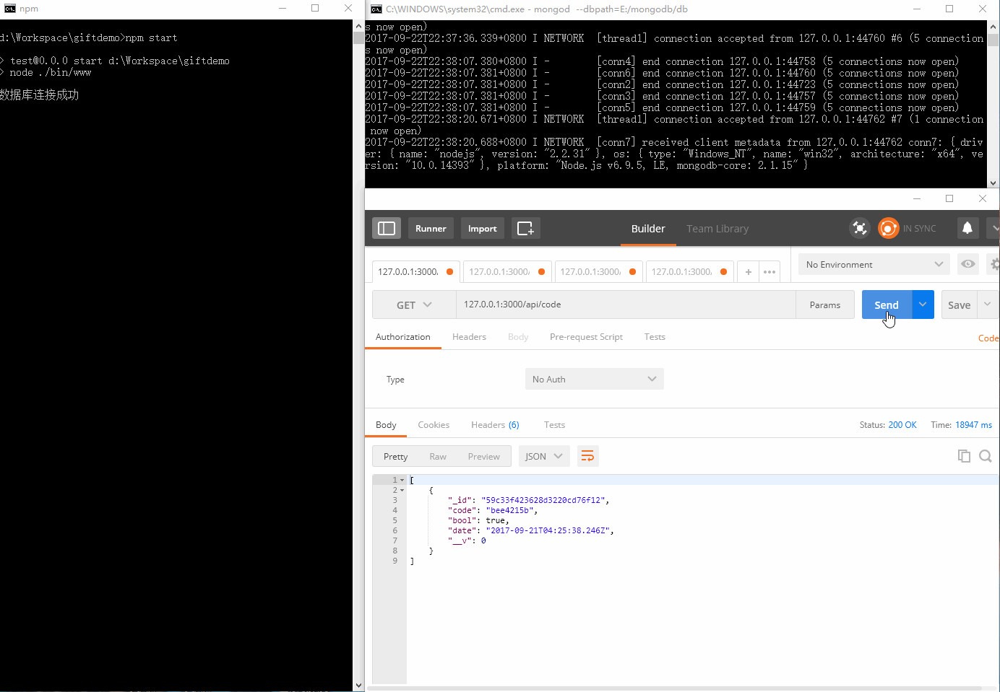

# 一个简单的礼包码demo
 
## 前言
 
一个朋友聊天时说到的需求，需要生成，使用，检查使用情况，获取礼包码功能，简单实现了一下
>  express mongoose mongodb
   接口调试用的postman
## 简介
 后端使用express,数据库mongodb（聊天时说的微信调用，回复特定游戏返回礼包码，新增查询使用时需增加游戏类型字段，暂时懒得加了）.
 用express的提供api供前端调用,前端ajax请求进行对数据库的CURD操作.
 
## 效果图
使用 postman时请选择CONTENT-TYPE,如application/x-www-form-urlencoded、application/json一类，否则可能会出错。
图里api/creat接口测试postman没在raw里选择json格式，就不重录了。



## 开发环境
需要本地安装[node](https://nodejs.org/en/),[npm](https://www.npmjs.com/),[mongodb](https://www.mongodb.com/)

## 初始化
本地的mongodb服务跑起来,默认 127.0.0.1:27017端口
 
## 使用

```bash
git clone git@github.com:LamperougeLS/giftdemo.git

cd giftdemo && npm install 

npm start 
```  


在此之前记得运行mongodb服务，等待安装依赖包，国内很慢可以用cnpm install安装（具体网上查查不详细写了）

使用Postman进行测试,测试成功的话,后端服务基本上就完成了.

## License

[MIT](https://opensource.org/licenses/MIT)


